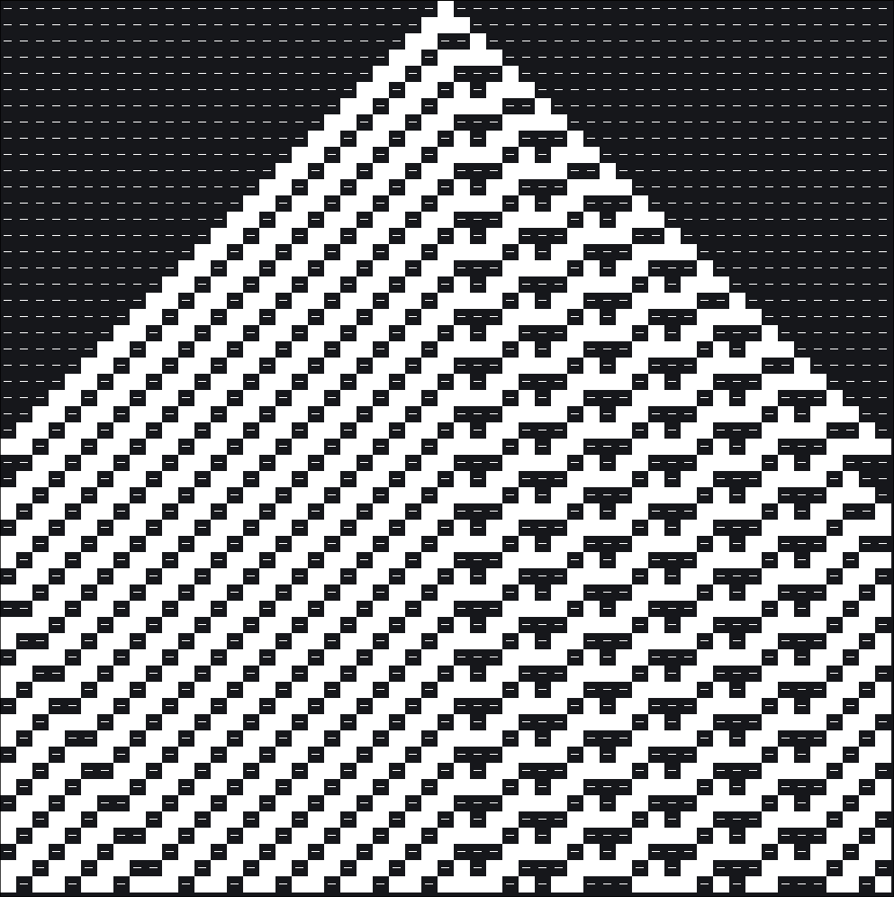
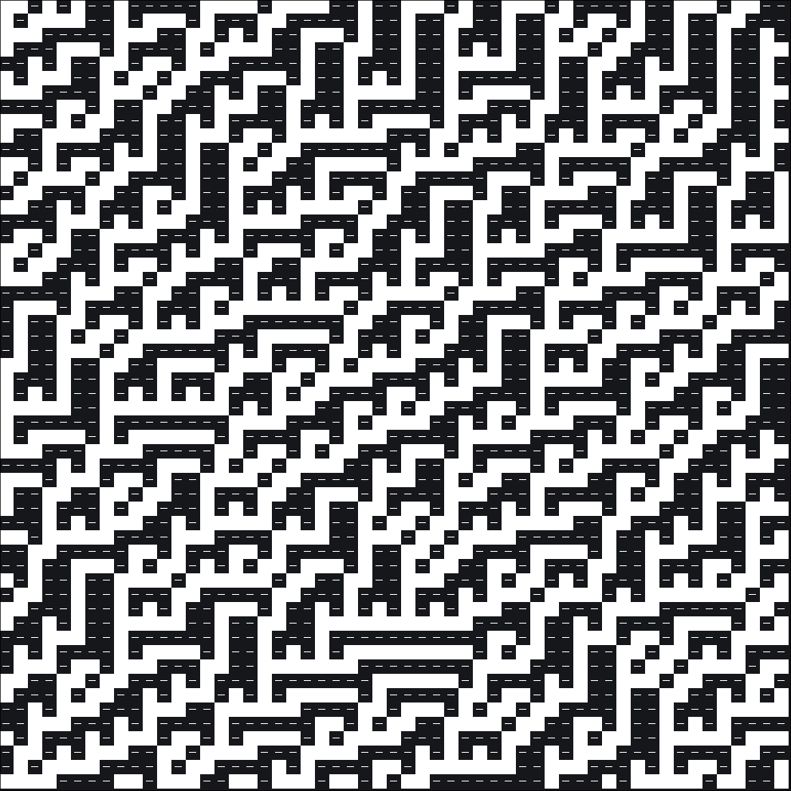

# Elementary-Cellular-Automata Explorer

A command-line program for experimenting with
[elementary cellular automata](https://en.wikipedia.org/wiki/Elementary_cellular_automaton). It takes as
argument the [Wolfram code](https://en.wikipedia.org/wiki/Wolfram_code) (0-255) of the rule, and optionally
an initial cell configuration (a sequence of ones and zeroes). By default, it runs until the entire terminal
is filled with cells (in an alternate terminal screen), but you can also manually specify the number of
generations to compute, and then add a delay between the generations to make it scroll. 


# Usage

Build the binary using `cargo build` and invoke it according to the manual below. Optionally, you can also
run it with `cargo run -- [OPTIONS] <RULE> [INITIAL]`. 

```
Usage: eca_explorer [OPTIONS] <RULE> [INITIAL]

Arguments:
  <RULE>
          The Wolfram code (0-255) of the rule

  [INITIAL]
          Initial cell configuration. If not specified, a random configuration with the same
          printed width as the terminal is used

Options:
  -e, --edges <EDGES>
          How the two edges are handled

          [default: wrap]

          Possible values:
          - copy: The previous edge values are retained
          - crop: Edge neighbours are set to `0`
          - wrap: Edge neighbours wrap around to the other side

  -g, --generations <GENERATIONS>
          Number of generations to run for. If not specified, the terminal height is used

  -d, --delay <DELAY>
          Number of milliseconds to delay before the next generation is computed

  -h, --help
          Print help (see a summary with '-h')
```


# Examples

### Rule 22 with a single toggled cell
```console
$ eca_explorer 22 0000000000000000000000000001000000000000000000000000000
```


### Rule 62 with a single toggled cell
```console
$ eca_explorer 62 0000000000000000000000000001000000000000000000000000000
```




### Rule 45 with randomized cells

```console
$ eca_explorer 45
```




### Rule 90 with randomized cells

```console
$ eca_explorer 90
```


